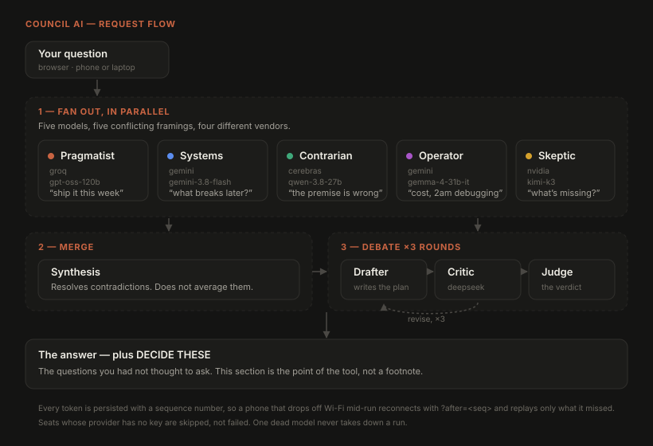

<h1 align="center">Council AI</h1>

<p align="center">
  <strong>Ask several AI models the same question at once, then make them argue about it.</strong>
</p>

<p align="center">
  Runs entirely on free API tiers &middot; no payment card &middot; no paid model &middot; no GPU
</p>

<p align="center">
  
  
  
  
</p>

---

Most AI tools give you an answer. The hard part of planning anything is usually
not the answer -- it is not knowing which questions to ask.

Council AI runs five models with **conflicting instructions** against the same
prompt, merges what survives, then puts the result through a Drafter / Critic /
Judge debate. Every mode ends with a section naming the decisions you still have
to make.



## See it work

**[→ Read a real run](examples/sample-run.md)** -- unedited, exported from the
app's own database.

The interesting part is not that the answers are good. It is that they
*disagree*. On "should I build a habit tracker", one model opened with *"ship a
single-page app with localStorage today"* while another opened with *"don't
build a tracker, build a retention engine -- 99% of habit apps fail on churn"*.
Four models given the same prompt would have agreed with each other and the
merge would have been mush.

## The three modes

| Mode | What runs | Time |
|---|---|---|
| **Quick** | 5 models in parallel, then one merges them | ~40s |
| **Debate** | Drafter writes, Critic attacks, Drafter revises &times;3, Judge rules | ~4min |
| **Full** | Quick, then the debate runs on the synthesised plan | ~7min |

## Design decisions worth defending

**No agent framework.** The fan-out is `asyncio.gather`; the debate is a `for`
loop over a transcript. LangGraph or AutoGen would add an abstraction to learn
and a layer to debug through, and buy nothing at this size.

**No two decision seats may run the same model.** A model attacking or judging
its own output shares the blind spots that produced the flaw. Seats also spread
across *providers*, because two models from one vendor fail together when that
vendor has an outage.

**Framings are not tied to a vendor.** A seat whose provider has no key keeps
its angle of attack and moves to any reachable model, so the tool degrades in
quality rather than going dark.

**Your phone can drop off Wi-Fi mid-run.** Every event is persisted with a
sequence number; a reconnecting client asks for `?after=<seq>` and replays only
what it missed.

## Setup

```bash
pip install -r requirements.txt
cp .env.example .env
```

Council runs on **free API tiers**. None of these need a payment card, and you
do not need all of them -- Council uses whatever keys it finds and skips the
rest. One key works; three or four is much better, because the entire value of
the synthesis comes from the answers being genuinely different.

| Provider | Key | Sign up |
|---|---|---|
| **Groq** (start here) | `GROQ_API_KEY` | <https://console.groq.com/keys> |
| **Google AI Studio** | `GEMINI_API_KEY` | <https://aistudio.google.com/apikey> |
| **Cerebras** | `CEREBRAS_API_KEY` | <https://cloud.cerebras.ai> |
| **GitHub Models** | `GITHUB_TOKEN` | <https://github.com/settings/tokens> - fine-grained, **must grant the `Models` permission** |
| **Mistral** | `MISTRAL_API_KEY` | <https://console.mistral.ai> (phone verification) |

**Verified live 2026-09-27**, because model names go stale fast:

- **Groq**: `openai/gpt-oss-120b`, `openai/gpt-oss-20b`, `qwen/qwen3.8-27b`. The
  rest of its catalogue is speech and safety classifiers, not chat models.
- **Gemini**: the 2.x line is retired for new accounts. Working: `gemini-3.8-flash`,
  `gemini-3.5-flash`, `gemini-flash-latest`. The `pro` models 429 immediately on
  the free quota. Google lists models as `models/x` but accepts bare `x`.
- **Cerebras**: only `gpt-oss-120b` and `qwen-3.8-27b` -- the *same families*
  Groq offers. It buys a separate rate-limit bucket, not a different voice.
- **GitHub Models**: a token without the `Models` permission returns a
  plain-text `200 OK` instead of a completion, which looks like success.

Put the keys in `.env`, then check everything before starting:

```bash
python check_key.py
```

That prints which providers are configured and validates every model slug
against its provider's live catalogue -- without ever printing a key. Fix
anything it flags, then run:

```bash
python -m uvicorn server:app --host 0.0.0.0 --port 8000
```

Open <http://localhost:8000>.

## Letting other people use your instance

Council can run on each user's own API keys instead of yours. Sign in, open
**API keys** in the sidebar, and paste a key per provider.

```
BYOK_ONLY=true
```

With that set, runs use only the signed-in user's keys and never fall back to
the host's. Set it on any instance other people can reach: one free tier allows
roughly 80 full runs a *day* across everyone, and reselling free-tier capacity
is how vendor accounts get closed.

Keys are encrypted with Fernet under a key derived per user via HKDF, so one
user's ciphertext cannot be read with another's derived key and cannot be moved
between accounts. They are never returned by the API in full -- only a masked
fragment. `COUNCIL_SECRET` is persisted rather than regenerated at boot,
because a master key that only lives in memory forces every user to retype
four API keys after every restart. Back it up; losing it makes stored keys
unrecoverable.

A key is **verified with a real API call before it is stored**. A credential
that authenticates but lacks permission is the worst kind of failure -- a
GitHub token missing the `Models` scope returns a plain-text `200 OK` that
parses as an empty answer, which looks exactly like success.

## Long-term memory (optional)

Point Council at a folder of markdown notes and it searches them before every
run, so you stop pasting the same project context into every prompt. An
Obsidian vault is exactly such a folder -- no plugin, no API, no sync service.

```
VAULT_PATH=C:/Users/You/Documents/My Vault
```

Notes are split at markdown headings, because a section is a unit of meaning:
retrieving `## Constraints` whole is useful, while 500 characters straddling
two topics is noise. Search uses SQLite's built-in FTS5 rather than embeddings
-- no embedding API, no vector store, no re-index pipeline, and a keyword match
is debuggable in a way a cosine score is not.

**Privacy.** Retrieved text is sent to the model providers. So the vault is
opt-in, `.private`, `.secret`, `.obsidian`, `.trash`, `.git`, `node_modules`
and `templates` are never indexed (add more with `VAULT_EXCLUDE`), and every
run displays exactly which notes it used. Nothing leaves quietly.

Retrieval is capped at ~3000 characters. That budget competes with the answer
for the same 8000 tokens/minute window, so unbounded recall would turn every
run into a `413`.

## Using it from your phone

`--host 0.0.0.0` is what makes this possible — without it the server only
accepts connections from the machine it runs on.

**Same Wi-Fi (easiest).** Find this machine's LAN address:

```bash
ipconfig
```

Look for `IPv4 Address` (something like `192.168.1.x`), then open
`http://192.168.1.x:8000` on your phone. Both devices must be on the same
network. Windows Firewall will probably prompt the first time — allow it for
private networks.

**Create an account first.** Open the app and use *Create account*; the first
account adopts any history that existed before accounts did. Anyone on the same
network can otherwise open the URL and spend your API quota.

Passwords are hashed with `hashlib.scrypt` (standard library, memory-hard, no
compiled dependency). Sessions live in SQLite, not in memory, so restarting the
server does not sign you out. Login is throttled to 8 failed attempts per
address per 5 minutes -- an unthrottled form defeats any password a human will
actually type.

Conversations are scoped to their owner in SQL rather than filtered afterwards,
because a filter forgotten at one call site leaks someone else's history while a
missing `WHERE` clause simply returns nothing.

`COUNCIL_PASSWORD` still works as a single shared gate, but only while no
account exists -- so self-hosters are not locked out by upgrading.

**From anywhere.** Use a tunnel:

```bash
cloudflared tunnel --url http://localhost:8000
```

That prints a public HTTPS URL. **Set `COUNCIL_PASSWORD` in `.env` before you do
this** — otherwise anyone who finds the URL is spending your OpenRouter credit.

Either way the PC has to stay awake and running the server. If you want it
available with the PC off, deploy it instead (any host that runs Python and
gives you a persistent disk for `council.db`).

The conversation lives on the server, so phone and desktop see the same history.
Pick up on your phone exactly where you left off on the desktop.

---

## Changing the models

Two files. `engine/providers.py` lists the providers (base URL + which env var
holds the key). `engine/config.py` assigns each seat a provider and a model:

```python
Agent(key="pragmatist", label="Pragmatist",
      provider="groq", model="llama-3.3-70b-versatile", ...)
```

Every provider speaks the OpenAI-compatible protocol, so adding a new one is a
few lines in `providers.py` and nothing else.

**Model slugs go stale.** Providers rename and retire models constantly. If a
run fails with "model slug probably wrong", run `python check_key.py` -- it
names the bad seat. To see what a provider currently offers:

```bash
curl "http://localhost:8000/api/models?provider=groq"
```

The **framings** matter more than the model choice. Four models given an
identical prompt return four similar answers, and merging those produces mush.
Each proposer is pushed toward a different angle on purpose, and the four sit on
four *different vendors* for the same reason. If you change the roster, keep
them in conflict.

Other tunables: `DEBATE_ROUNDS` (3 -- past 4 the Drafter starts agreeing with
everything), token ceilings, `MEMORY_TURNS`, and `MAX_PARALLEL_PER_PROVIDER`.

## Cost and limits

Money: none. Every provider in the default roster has a free tier.

What you pay instead is **rate limits**. A Quick run is 5 calls, Debate is 8,
Full is 12 -- and free tiers cap requests per minute and per day. Spreading the
four proposers across four different providers is what makes the parallel
fan-out work at all; four seats on one provider would trip its per-minute limit
immediately.

Groq's free tier is **8,000 tokens per minute** and 1,000 requests per day. The
per-minute token cap is the binding constraint, not the request count -- which
is why seats sharing a provider run one at a time by default, and why the token
budgets in `config.py` are sized the way they are. A Quick run takes about 20
seconds under that limit.

A 429 is retried automatically (up to 3 times, honouring `Retry-After`) as long
as the seat has not already started streaming. If it still fails, that seat
reports the error and the others carry on.

**Reasoning models need headroom.** `openai/gpt-oss-*` stream their chain of
thought before the answer, and those tokens count against `max_tokens`. Too
small a budget produces an empty response with no error at all -- so the client
detects that case and raises a message telling you to raise the budget. The
reasoning itself is streamed to the UI and shown dimmed while a seat thinks.

## Architecture

```
static/          the UI: one HTML page, no build step, no framework
server.py        FastAPI: conversations, turns, SSE streaming
db.py            SQLite: conversations, turns, and an append-only event log
check_key.py     preflight: which providers work, which slugs are stale
engine/
  config.py      the roster and tunables   <- start here
  prompts.py     the personas              <- and here
  providers.py   free providers and their base URLs
  orchestrator.py  fan-out/fan-in, and the debate loop
  llm.py         provider-agnostic streaming client
```

**No agent framework.** Feature 1 is `asyncio.gather` over N calls; feature 2 is
a `for` loop over a growing transcript. LangGraph or AutoGen would add an
abstraction to learn and a layer to debug through, and buy nothing at this size.

**One client, many providers.** Everything speaks OpenAI-compatible chat
completions, so `engine/llm.py` handles all of them and only the base URL and
auth header change. Seats whose provider has no key are skipped, not failed.

**Every event is persisted with a sequence number.** The UI streams live over
SSE but the database is the record. A client that drops off — phone locking,
Wi-Fi to cellular, tab backgrounded — reconnects with `?after=<last seq>` and
replays only what it missed. Nothing is lost and nothing arrives twice.

**Free tiers fail constantly, so failure handling is most of the work.**
429 (rate limited), 5xx (provider overloaded -- Gemini does this often),
timeouts and DNS blips are all retried up to 4 times with backoff, honouring
`Retry-After`. A retry only happens before the seat has streamed anything,
since the stream cannot be rewound. 413 is NOT retried: a request too large
never becomes small by waiting.

**Partial failures degrade, they don't cascade.** One dead proposer leaves the
other three. A failed Aggregator returns the raw proposer answers rather than
discarding work you already paid for. A failed Judge returns the last revision
of the plan. Only losing *every* proposer, or the initial draft, fails a run.

---

## What building this actually taught me

Most of the code is failure handling, because free tiers fail constantly:

- **Reasoning models return empty responses when starved of budget.** They
  spend tokens thinking before writing a word, and the share varies by prompt,
  not just by model. Four different families blew four different ceilings, each
  time returning HTTP 200 with no content and no error. The client now detects
  this and retries with a larger budget instead of guessing per model.
- **Thinking arrives two ways** -- as separate `reasoning` deltas, or inline in
  the content wrapped in `<thought>` tags. The inline kind leaks raw thinking
  into the answer and into the next debate round unless stripped.
- **A provider's model listing can include models it will not serve.**
- **A credential can authenticate and still be wrong.** A GitHub token missing
  the `Models` permission returns a plain-text `200 OK` that parses as an empty
  answer -- success-shaped failure, the worst kind.
- **One vendor's outage takes out every seat on it at once**, so decision seats
  are spread across providers, not just across models.

## Tests

Both run offline against a fake model and cost nothing:

```bash
python smoke_test.py    # the engine: all modes, and every partial-failure path
python test_server.py   # HTTP, SSE, persistence, reconnect replay, memory
```

Run them after touching the orchestrator or the event bus. The event-ordering
bug they caught — concurrent emits overtaking each other and getting silently
discarded by the subscriber's dedupe — is invisible until you look for missing
sequence numbers.
